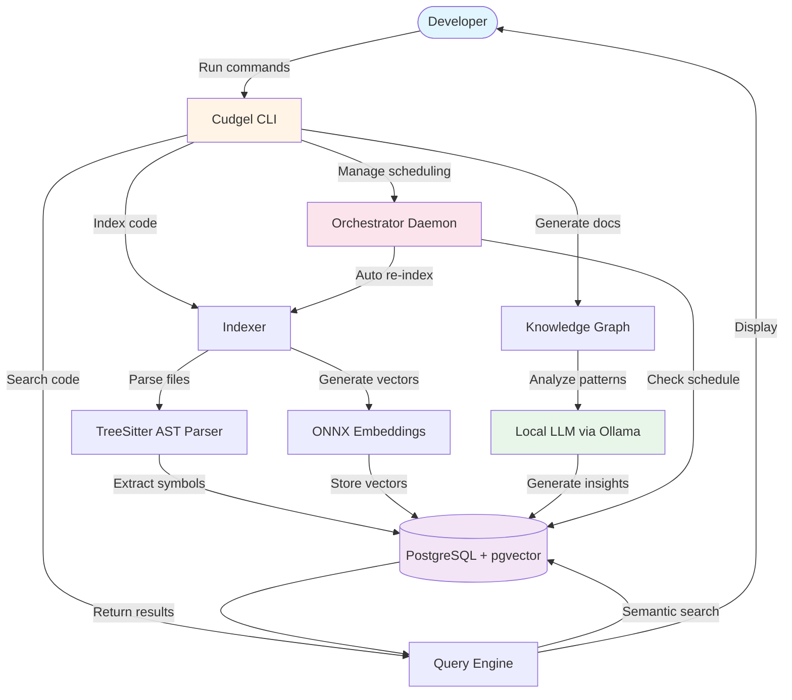
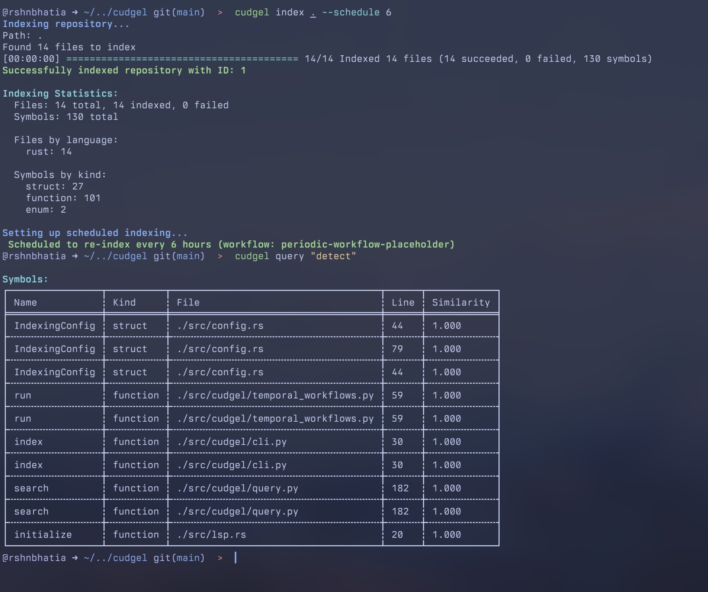

# Cudgel

> **/ˈkʌdʒ.əl/** 
> 
> *noun*:
>   a short, thick stick used as a weapon.
> 
> *verb*: 
>   to beat with a cudgel.

`cudgel` is a code indexing tool designed to help supercharge your LLM prompts by providing knowledge and context up front within your queries, accross all your repositories.

As the name implies, it's not meant to be a replacement for tools like `find`, `fd`, `grep`, `ripgrep`, and `ast-grep` that are better at tightly scoped searching that provides precise results, but rather store and provide more general information about a repository.

It's inspired by tools like:
- https://github.com/tree-sitter/tree-sitter
- https://ast-grep.github.io
- https://github.com/Davidyz/VectorCode
- https://github.com/modelcontextprotocol/servers/tree/main/src/memory

It's built with tools like `Rust`, `Postgres`, `TreeSitter`, `uv`, `ONYX`, `llama3`, and `Ollama` to provide a local-first, privacy-focused experience.

## Architecture

`cudgel` is comprised of a few discrete components:
- `cudgel index`: Start index tasks manually and register/deregister scheduled repository index tasks. 
- `cudgel orchestrator`: A daemon process that runs in the background, managing scheduled index tasks.
- `cudgel query`: Take a string as a query and return the results of the indexing process.
- `cudgel knowledge`: Maintain a knowledge graph of the indexed repo using local LLMs through `llama3.2:8b` via Ollama w/ support for manual edits.

`cudgel` stores all it's data in a local Postgres database. It's designed to be local-first and self-contained.

### Indexing

'Indexing' is very much an overloaded term in this context.

`cudgel` uses TreeSitter to extract ASTs from the codebase, and then stores those ASTs as graphs in Postgres. It also generates embeddings for the ASTs, symbols, and call hierarchies via `ONYX` via the `sentence-transformers/all-MiniLM-L6-v2` model for semantic code embeddings, which are stored in a vector database.

Hierarchical Navigable Small Worlds (HNSW) is used as the indexing strategy. HNSW tends to work better for the sizes of codebases I tend to deal with day-to-day. https://www.pinecone.io/learn/series/faiss/hnsw/ provides a nice introdcution to how the approach works.

## Closing thoughts

Disclaimer: a lot of this has been out of my depth. I'm an infrastructure engineer by trade who works on Kubernetes at scale. The primary motiviation behind this was to make a tool that works decently enough to define relationships accross various kinds of codebases -- repositories that house nested go templates, Kubernetes controllers, various microservices, CI workflow definitions, CLI tools, etc. 

This project was built on a number of devtools I created previously (see https://github.com/roshbhatia/sysinit for the Neovim config which contains lua code that I started using to inject context into my prompts to various CLI tools) but this project was built via a combination of Claude Code, spec-kit, and my own manual tools.

